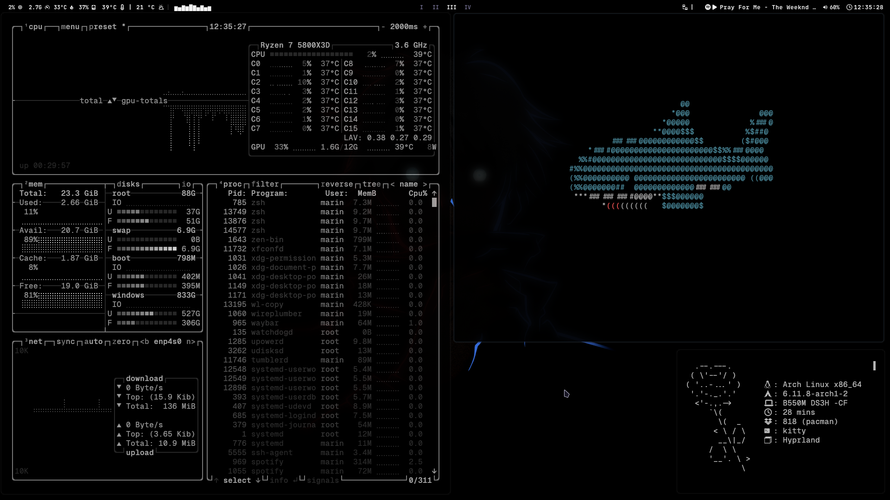
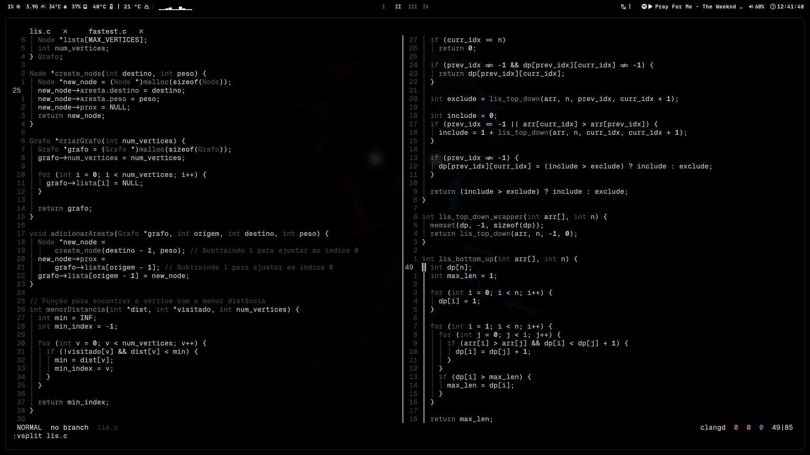
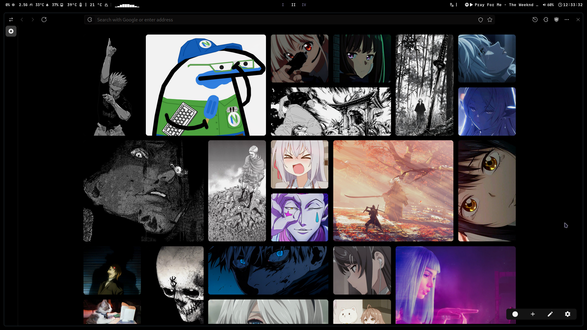

<h2 align="center"/>.s</h2>

- **Window Manager:** <a href="https://github.com/hyprwm/Hyprland">Hyprland</a>
- **Prompt:** <a href="https://ohmyposh.dev/">Oh My Posh</a>
- **Terminal:** <a href="https://github.com/kovidgoyal/kitty">Kitty</a>
- **Status Bar:** <a href="https://github.com/Alexays/Waybar">Waybar</a>
- **App Launcher:** <a href="https://hg.sr.ht/~scoopta/wofi">Wofi</a>

